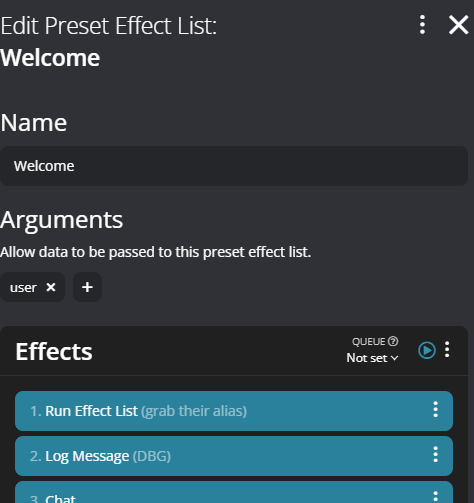

# Utility-Alias

# Description
 Allows you to set and use aliases for chat users

# Compatibility
- Firebot 5.61.2+

# Install
+ Download
  + Alias.firebotsetup
+ Import the downloaded firebotsetup file

# Usage

## Requirements for Chat
+ Must be in Firebot's user database

## Streamer Info
+ Commands
    + Syntax
        + !alias action user alias
    + Action (choose one of the options listed)
        + add/new 
            + adds a new alias for the specified user
        + edit/update
            + feature not yet implemented, coming soon :tm:
        + remove/delete
            + removes an alias for the specified user
+ Examples
    + !alias add arblane urb leh nine
    + !alias add arblane arrrr blaine
    + !alias add arblane Some Random String
+ Storage
    + Alias is stored as a JSON object in the user's meta data
        + Sample object (minified)
            + [{"id": "urblehnine","alias": "urb leh nine"},{"id": "arrrrblaine","alias": "rrrr blaine"},{"id": "Some Random String"}]
+ Usage
    + Preset Effect List "[Utility] Get Alias"
        + Pass the user name (via $#user) from the preset effect argument list, built-in to the setup
        + Effect randomizes from the set metadata, or in the abscence of, uses their name as-is
        + Stores it temporarily in a custom variable (CV), randomAlias
            + Use the CV in any context you would like.
                + TTS
                + Chat effect
                + Etc
  
        
